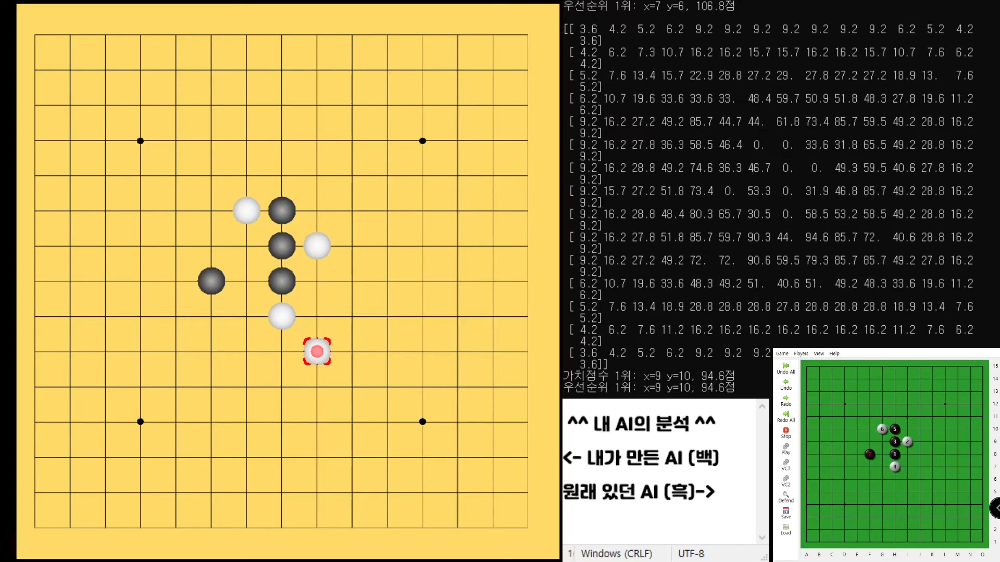

# Omok-AI

## 오목 AI 만들기!

---

### 알고리즘 AI

- 성능: 한 수 앞은 거의 완벽히 내다봄
- 개발 완료

### 딥러닝 AI 

- 성능: 알고리즘 AI 미만
- 개발 보류 중...

---

## 파일 설명

`omok_pygame.py` - pygame을 이용해 게임 실행 (Yixin에게서 학습 지원)

`omok_tool.py` - 오목 게임 툴 코드 (Yixin에게서 학습 지원)

`train_omok.py` : 사전 준비된 데이터로 학습 

`hyperparameter_optimization.py` : 최적화 방법(optimizers)과 학습률 (learning rate)에 따라 달라지는 학습 속도 비교

`saved_pkls/` : 학습한 모델 저장하는 위치

`modules/` : 학습에 필요한 기능들

---

## 딥러닝을 통한 오목 AI 만들기!

현재까지 만든 학습 데이터

- 4 -> 5목